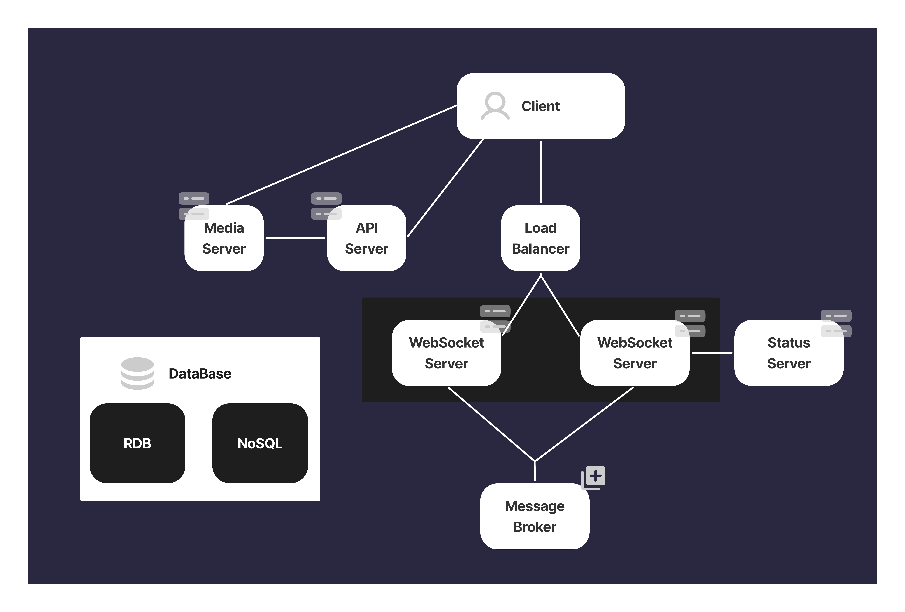

  <h1>DIZZYCODE</h1>
  <strong>Discord Clone Project</strong>

  

# Tech Stack

| Stack                                                                                                                                                                                                                               |                         |
| ----------------------------------------------------------------------------------------------------------------------------------------------------------------------------------------------------------------------------------- | ----------------------- |
|                                                                                                                                  | Libary                  |
|                                                                                                                        | Language                |
|                                                                                                                     | Server State Management |
|                                                                                                                              | Client State Management |
|   | UI                      |

 

## Features in this application

<!--
1. Flow Chart
2. GIF
3. 설명 with 그래프
4. 블로그
 -->

> **CHAT**

[📱 Websockets (Sock.js, STOMP)](./docs/features/chat.md)  
[💬 1:1(DM), N:N(Channel) Chat](./docs/features/chat.md)  
[📁 Drag&drop file upload](./docs/features/dnd.md)  
[🟢 Real-time on/offline status tracking](./docs/features/status.md)

<!-- ☑️ Real-time read/unread message marking _(Coming Soon)_ -->

> **VIDEO CONFERENCE**

[🤯 1:1, N:N Video Conference w/ OpenVidu (Kurento based)](./docs/features/openVidu.md)  
[📺 Screen Share](./docs/features/openVidu.md)

> **EXPLORE**

🗺️ Search & Join Room

> **FRIEND**

[👯 Add Friend](./docs/features/friend.md)

 

## Architecture

> **Client/Server Communication**

> **Deployment**

<!-- TODO: add image -->

 

## Articles

[Blog 1](https://hwanheejung.tistory.com/category/Projects%2CActivity/DizzyCode%28React%29)  
[Blog 2](https://velog.io/@mikio/series/DizzyCode)
