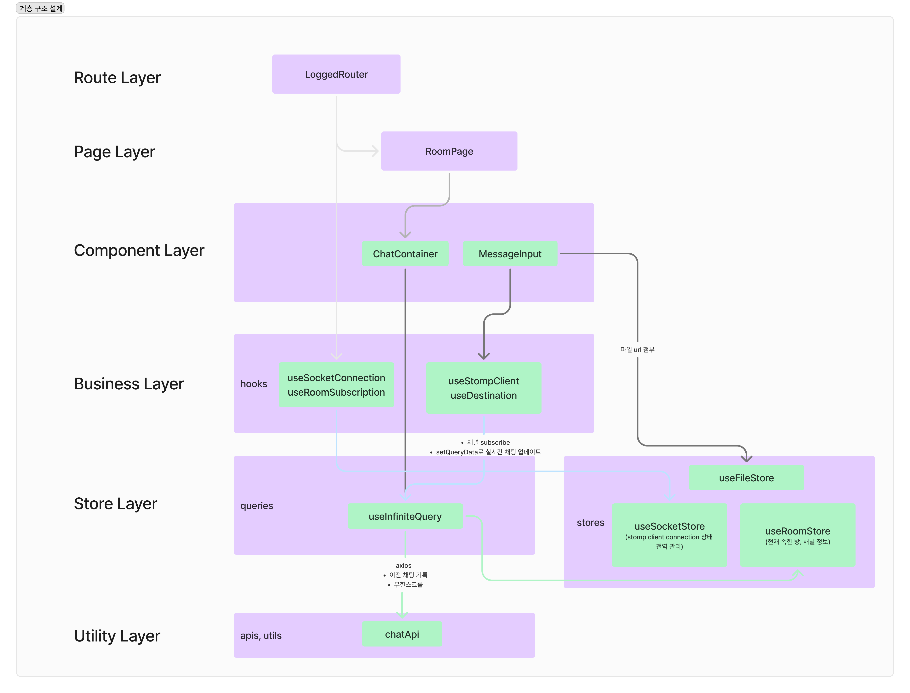
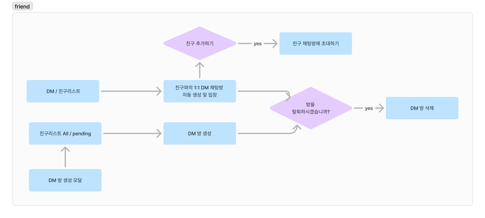

# 1. 웹소켓 연결부터 채널 입장, 채팅까지

> **1) 사용자 A가 DizzyCode 로그인:** 

1. 웹소켓 연결 👉 [상세보기](https://hwanheejung.tistory.com/43)   
    
    [client]
    
    - JWT를 사용하여 Secondary Token 발급을 요청한다.
    
    [server]
    
    - 서버는 클라이언트가 JWT를 보내면, 이를 검증한 후 ST를 반환한다.
    - 이때 유효기간은 30초 정도로 매우 짧게 둔다.
    
    [client]
    
    - ST를 쿼리 파라미터에 넣어서 보내 웹소켓 업그레이드를 요청한다.
    
    [server]
    
    - HandshakeInterceptor를 사용하여 ST를 추출하고 검증한다.
    - 웹소켓 연결 시 유효기간이 짧은 secondary token을 도입해 초기 연결의 보안성을 높이고, 이후의 STOMP 연결과 메시지 전송 과정에서는 JWT를 사용하여 지속적인 인증 및 권한 관리 수행

2. 연결 성공 시 A가 속한 모든 방들 subscribe
    - 여기로 온 메시지들은 {roomId, categoryId, channelId} 형식으로 오며, 채널에 온 새로운 채팅 알림을 위함 


<br>

> **2) A가 채팅하기 위해 채널1에 들어감:** 

1. 채널1 subscribe 
    - 해당 경로로 온 메시지들은 화면에 바로바로 업데이트
      
2. 메시지 보낼 때 app 토픽으로 publish  
    
    ```tsx
    if (client && isConnected) {
      const destination = `/app/rooms.${roomId}.categories.${categoryId}.channels.${channelId}`;
      client.publish({
        destination,
        headers: {
          Authorization: `Bearer ${localStorage.getItem('accessToken')}`,
        },
        body: JSON.stringify(body),
      });
    }
    ```
    
<br>

> **3) 채널1 퇴장, 채널2 입장:**

- 채널1 unsubscribe, 채널2 subscribe

<br>

> **4) 로그아웃:** 

- 모든 방, 채널 구독 취소, 웹소켓 연결 종료


<br>

# 2. 계층 구조 설계 



<br>

# 3. useInfiniteQuery 무한스크롤   
**기능**   
- TanStack Query의 useInfiniteQuery를 활용해 채팅 메시지를 20개씩 끊어서 요청

**원리**
- 첫 로드 시, 초기 20개의 메시지를 가져옴.
- 스크롤이 특정 지점에 도달하면 fetchNextPage를 호출하여 추가 메시지를 로드.
- 이전에 가져온 데이터를 유지하면서 새로운 데이터만 추가.

**효과**
- 필요 이상의 데이터 로딩을 방지하여 성능 최적화

<br> 

# 4. 캐싱
**기능**
- 한번 들어온 채팅방의 데이터를 TanStack Query의 캐시에 저장하여, 동일한 채팅방으로 재입장 시 네트워크 요청을 최소화.

**원리**
- 채팅방 데이터는 쿼리키 ['chats', currentChannelPath]를 기반으로 캐시에 저장됨.
- currentChannelPath가 동일한 요청은 캐싱된 데이터를 반환하며 불필요한 네트워크 호출 방지

**효과**
- 네트워크 부하 감소
- 캐싱된 데이터를 즉시 로드하여 빠른 사용자 경험 제공

<br>

# 5. Blog

[**웹소켓 개념**](https://hwanheejung.tistory.com/39)   
[**웹소켓+STOMP**](https://hwanheejung.tistory.com/42)   
[**리액트로 구현하고 이해해보는 웹 소켓 + STOMP**](https://velog.io/@mikio/websocket-stomp)   
[**웹소켓 JWT 시나리오**](https://hwanheejung.tistory.com/43)   


<!---
# 0. 공통 핵심 기능 (DM, Channel)

DM과 Channel에 공통적으로 사용되는 핵심 기능으로는 메시지 입력 및 파일 첨부 기능, 무한 스크롤 채팅 로딩, 실시간 메시지 업데이트 등이 있습니다. 

<details>

## 0.1. 메시지 입력 및 파일 첨부 기능

### 0.1.1. 메시지 입력

- `MessageInput`: 사용자가 텍스트 메시지를 입력하고, 파일을 첨부할 수 있는 입력 필드 컴포넌트입니다.
- 사용자는 `Input` 컴포넌트를 사용하여 `Enter` 키를 누르거나 전송 버튼을 클릭하여 메시지를 전송할 수 있습니다.

### 0.1.2. 파일 첨부 기능

- `useDropzone`을 사용하여 드래그 앤 드롭 인터페이스를 제공, 파일을 쉽게 첨부할 수 있습니다.
- 첨부된 파일은 `FilePreview` 컴포넌트를 통해 미리 보고, 제거할 수 있습니다.

## 0.2. 무한 스크롤 채팅 로딩

### 0.2.1. 과거 메시지 목록 불러오기

- `DmContainer` , `ChatContainer` 에서 메시지 목록을 보여주고, 무한 스크롤을 통해 과거의 메시지를 불러옵니다.

### 0.2.2. 무한 쿼리 기능

- `useInfiniteQuery`: `react-query`의 무한 쿼리 기능을 사용하여 페이지네이션된 메시지 데이터를 관리합니다.
- `useRef` 및 `useCallback`: 스크롤 이벤트를 관리합니다.

## 0.3. 실시간 메시지 업데이트

- `DMSection`, `ChatSection` 으로 실시간으로 메시지를 받고 업데이트하는 전체 DM 섹션, Chat 섹션을 포함합니다.
- `useSocketStore` 및 `useStompClient`: WebSocket 연결을 관리하고 STOMP 프로토콜을 사용하여 실시간 메시지 구독 및 발행을 합니다.
- `subscribe` 및 `unsubscribe`: 특정 토픽을 구독하고 구독 해제를 관리합니다.

</details>

# 1. Flow Chart



# 2. GIF

# 3. DM 핵심 기능

DM의 핵심적인 기능에는 DM방 생성, DM방 목록 조회, 친구 초대 기능, 방 멤버 제거, DM 방 삭제 기능이 있습니다. 

<details>

## 3.1. DM 방 생성

- `createDmRoomApi`를 호출하여 서버에 새 방을 생성합니다.
- 성공 시, 생성된 방의 ID로 현재 DM 방의 ID를 설정하고, 방 목록 쿼리를 무효화하여 최신 목록을 반영합니다.
- 사용자를 새로 생성된 방의 채팅 화면으로 리디렉션합니다.

## 3.2. DM 방 목록 조회

- `getDmRooms` 함수를 호출하여 서버에서 DM 방 목록을 가져옵니다.
- `react-query`의 `useQuery`를 사용하여 데이터 캐싱, 로딩 상태 관리, 에러 핸들링을 자동으로 처리합니다.

## 3.3 DM 방 상세 조회

- 주어진 방 ID를 사용하여 `fetchDmRoomDetailsApi`를 호출합니다.
- 방 정보가 변경될 수 있으므로, 해당 쿼리 키를 기반으로 쿼리 결과를 캐시합니다.

## 3.4. 방 멤버 추가

- `addMemberMutation` 을 통해 특정 DM 방에 새로운 멤버를 추가합니다.
- `addMemberToRoomApi`를 호출하여 서버에 멤버 추가를 요청합니다.

## 3.5. DM 방 탈퇴

- `deleteRoomMutation` 을 통해 DM 방을 탈퇴합니다.
- `deleteRoomApi` 를 호출하여 서버에 유저의 방 제거를 요청합니다.

</details>

# 4. Channel 핵심 기능

-->


