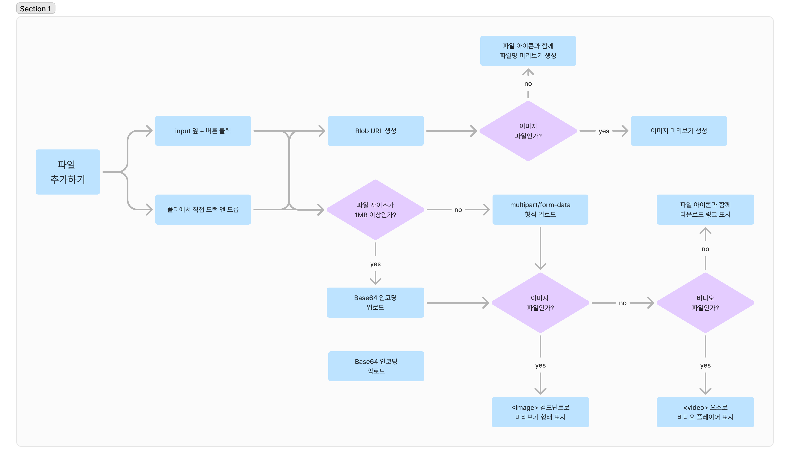

# 📁File Drag & Drop👆

# 1. Flow Chart

# 2. GIF

# 3. 핵심기능

사용자가 파일을 드래그 앤 드롭을 하거나 input 창 좌측에 있는 + 버튼을 눌러 파일을 선택하면 사용자에게 파일 미리보기 기능을 지원합니다. 이와 동시에 파일 크기에 따라 `multipart/form-data` 혹은 `Base64 encoding` 방식으로 파일을 업로드 합니다. 파일 업로드가 완료된 후 사용자가 전송 버튼을 누르면 파일과 함께 메시지를 전송합니다. 

    
 ## 3.1. 파일 선택
    
사용자가 파일을 드래그 앤 드롭을 하거나 input 창 좌측에 있는 + 버튼을 누르는 두 가지 방식을 통해 파일을 선택할 수 있습니다.  공통적으로 선택된 파일들은  `onChange` 이벤트 핸들러가 이를 처리하여 Zustand 스토어의 `addFiles` 함수를 호출합니다.
    
### 3.1.1 Drag & Drop
    
 - **`useDropzone` 훅 사용:** React-Dropzone 라이브러리의 `useDropzone` 훅을 사용하여 드래그 앤 드롭 영역을 설정합니다. `onDrop` 콜백을 통해 드롭된 파일들을 처리하고 Zustand 스토어의 `addFiles` 함수를 호출하여 상태에 파일들을 추가합니다.
 - **상호작용 피드백:** 드래그 중일 때 (`isDragActive`), 화면 전체에 파일을 놓으라는 메시지를 표시하는 오버레이를 동적으로 보여줍니다. 이는 사용자가 드래그 앤 드롭 영역 위에 파일을 가져다 놓을 때 명확한 시각적 피드백을 제공합니다.
    
### 3.1.2 +버튼 클릭
    
 - **파일 선택 버튼:** 사용자가 메뉴 항목을 클릭하면 숨겨진 `<input type="file">` 요소가 활성화되어 파일 탐색기가 열립니다.
    
## 3.2 파일 미리보기 처리
    
사용자가 파일을 선택하고 나면, 선택된 파일들은 메시지 전송하기 전에 사전 처리됩니다. 이 과정에서 파일의 크기에 따라 적절한 업로드 방식이 결정되며, 이는 네트워크 효율성과 서버 부하를 최적화하는 데 중요한 역할을 합니다.
    
### 3.2.1 파일 크기 검사 및 처리 방식 결정
    
선택된 각 파일은 크기를 확인하고, 그에 따라 `multipart/form-data` 형식 또는 `Base64 encoding` 방식 중 하나로 서버에 전송됩니다. 이러한 결정 로직은 다음과 같이 구현됩니다:
    
- **파일 크기 확인:** 파일 객체의 `size` 속성을 검사하여 파일의 크기를 확인합니다.
- **업로드 방식 결정:**
- **1MB 이하:** 파일 크기가 1MB 이하인 경우, 파일을 `Base64`로 인코딩합니다. 이는 주로 이미지와 같은 미디어 파일에 사용되며, 인코딩된 문자열을 JSON 객체로 서버에 전송합니다.
- **1MB 초과:** 파일 크기가 1MB를 초과하는 경우, `multipart/form-data` 방식을 사용합니다. 이 방식은 대용량 파일 전송에 적합하며, 파일 데이터를 여러 부분으로 나누어 전송합니다.
    
### 3.2.2 이미지 파일 처리 및 미리보기 렌더링
    
사용자가 업로드하는 파일이 이미지일 경우, 해당 이미지에 대한 미리보기 기능을 제공합니다. 
    
### 파일 타입 확인
    
파일의 `type` 속성을 확인하는 것을 통해 (예: `image/jpeg`, `image/png` 등) 업로드된 파일의 MIME 타입을 검사하여 파일이 이미지인지 여부를 결정합니다.  미리보기 가능한 이미지 파일의 경우, 해당 이미지를 사용자에게 보여주는 UI 컴포넌트를 렌더링합니다. 아닌 경우에는 단순한 파일 아이콘과 파일명을 함께 명시합니다.
    
## 3.3. 파일 전송 후 랜더링
    
업로드된 파일 URL을 포함하여 메시지를 전송 후 파일이 채팅에 포함될 때, `ChatBox` 컴포넌트에서 파일을 랜더링하는 과정은 다음과 같습니다.
    
### 3.3.1. 파일 확장자 확인 및 파일 랜더링
    
- `renderFile` 함수는 파일 URL을 받아 파일의 유형을 확인하고 적절한 랜더링을 수행합니다.
- **이미지 파일:** 파일 확장자가 이미지 파일인 경우, `<Image>` 컴포넌트를 사용하여 이미지를 미리보기 형태로 표시합니다. 사용자가 이미지를 클릭하면 이미지가 새로운 탭에서 열리도록 설정합니다.
- **비디오 파일:** 파일 확장자가 비디오 파일인 경우, `<video>` 요소를 사용하여 비디오를 컨트롤할 수 있는 플레이어로 표시합니다. 비디오는 일정 크기로 제한되어 있으며, 비디오 태그를 통해 재생이 가능합니다.
- **기타 파일:** 이미지와 비디오 파일이 아닌 경우, `<Flex>` 컴포넌트를 사용하여 파일 아이콘과 파일 이름을 포함한 다운로드 가능한 링크로 표시합니다. 이 링크를 클릭하면 파일이 다운로드됩니다.
    
### 3.3.2 파일명 추출
    
`getFileNameWithExtension` 함수는 파일 URL에서 파일 이름과 확장자를 추출하여 파일의 이름을 반환합니다. 이 이름은 파일 랜더링 시 파일 아이콘과 함께 표시됩니다.
    

# 4. Blog

[리액트에서 드래그 앤 드롭으로 파일 올리기 : 직접 구현 vs 라이브러리](https://velog.io/@mikio/drapNdropReact-ReactDropZone#usedropzone)

[파일 이미지 미리보기 프리뷰 기능 만들기](https://velog.io/@mikio/filepreview-blob-react-zustand)
