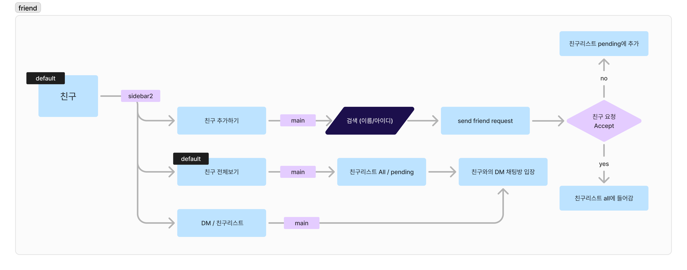
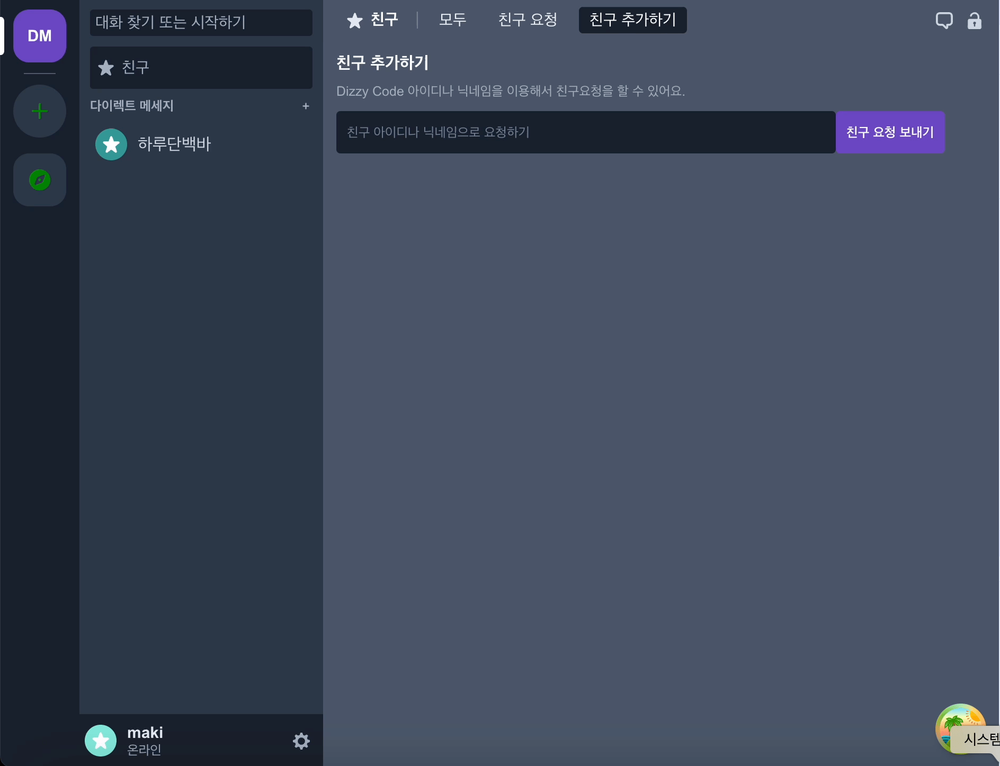
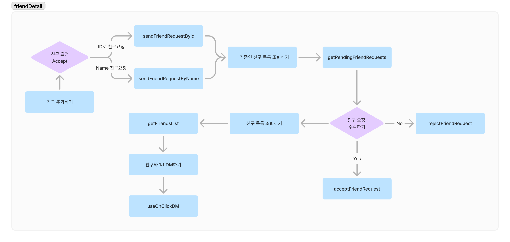

# 1. Flow Chart

# 2. GIF

# 3. 핵심 기능

친구 기능은 최대한 사용자 간의 상호 작용을 원활히 하고, 친구 관계를 효과적으로 관리하는 데에 초점을 두었습니다. 

핵심 기능으로는 친구 요청 보내기 (ID로 친구 요청, 이름으로 친구 요청), 친구 요청 응답 처리 (수락, 거절), 친구 목록 관리 (친구 목록 조회, 대기 중인 친구 요청 조회, 친구 요청 삭제)와 같은 기능들을 제공하고 있습니다. 

# 4. Blog

[**React Query와 Custom Hooks를 이용한 친구 관리 시스템 구현하기**](https://velog.io/@mikio/ReactQueryCustomHooksWeAreFriends)
